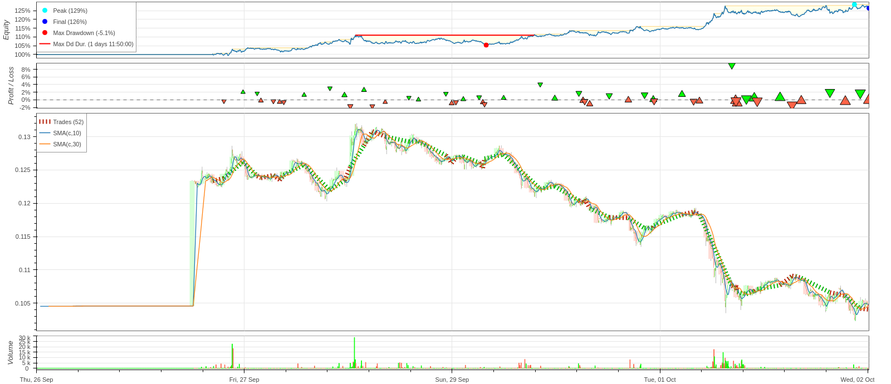

### Extended SMA Cross Strategy Overview

#### 1. **Focus**
The **Extended SMA Cross Strategy** combines traditional technical analysis (Simple Moving Average crossovers) with sentiment analysis based on news headlines. The primary goal is to maximize profitability by aligning market trends with prevailing sentiment, adding an extra layer of decision-making based on market sentiment to the standard SMA crossover approach.

___

#### Performance Metrics

With a **26.44% return** over almost seven days, the report beat the **Buy & Hold return of -0.38%** by a wide margin, demonstrating the strategy's profitability even in a slightly decreasing market.

Strong risk-adjusted returns are shown by the **Sharpe ratio of 1.74**, and a solid profitability indicator, the **profit factor of 2.56**, showing that the strategy makes $2.56 for every dollar lost. Nearly half of the transactions are lucrative, as indicated by the **48.08%** win rate, with the **best trade** returning 9.07%**. 

Although there is considerable downside risk indicated by the **maximum drawdown of 5.09%**, the **Sortino ratio (infinity)** indicates that the approach performs effectively with little downward volatility.

In summary, this SMA approach exhibits significant profitability, robust risk mitigation, and a remarkable capacity to provide returns despite adverse market circumstances.

___

#### 2. **Market Focus**
The strategy is designed for use in **cryptocurrency markets**, specifically targeting the **DOGE/USD pair**. The inclusion of sentiment analysis makes it highly adaptable to other markets that are influenced by news and media, though it’s optimized for volatile assets like Dogecoin.

#### 3. **Time Horizon**
This is a **short-term trading strategy** intended to run for a maximum of **14 days**, with trades executed based on **five-minute intervals**. It is suitable for day traders and short-term swing traders who aim to capitalize on rapid price changes and market sentiment shifts.

#### 4. **Indicators**
The strategy employs two key components:
- **Technical Indicator:**
  - **SMA Crossover**: Uses a 10-period SMA and a 30-period SMA to detect trend reversals. A crossover of the 10-period SMA above the 30-period SMA generates a buy signal (bullish trend), while the opposite crossover generates a sell signal (bearish trend).
  
- **Sentiment Indicator:**
  - **Sentiment Analysis**: Fetches recent news headlines related to the asset and estimates market sentiment (positive or negative). When sentiment is **highly positive** (probability > 0.999), it signals strong bullish momentum; when **highly negative**, it signals bearish momentum.

#### 5. **Execution**
The strategy operates as follows:
- **Buy Signal**: If the 10-period SMA crosses above the 30-period SMA (bullish crossover) or sentiment analysis indicates an extremely positive sentiment with high confidence (probability > 0.999), the strategy initiates a long position.
- **Sell Signal**: If the 30-period SMA crosses above the 10-period SMA (bearish crossover) or sentiment analysis indicates highly negative sentiment, the strategy initiates a sell or short position.
- **Position Management**: Any open position is closed before executing a new trade to avoid overlapping positions, and the strategy trades with an order size of **99.9%** of the available capital.

#### 6. **Why It Works**
The **Extended SMA Cross Strategy** enhances traditional technical analysis by incorporating real-time sentiment analysis. Here's why this approach can be effective:
- **Market Sentiment Influence**: Cryptocurrency markets are highly reactive to news, and sentiment analysis allows the strategy to capitalize on this. By filtering news headlines and quantifying sentiment, it ensures that trades are aligned with broader market sentiment.
- **Dual Confirmation**: By combining **technical signals** (SMA crossover) with **sentiment-based signals**, the strategy seeks to avoid false positives from either indicator, increasing the likelihood of entering trades in the direction of stronger trends.
- **Volatility Capture**: The integration of fast-moving market sentiment with short-term price movements positions this strategy to perform well in volatile markets like Dogecoin, where both technical trends and news events drive price action.

This strategy is ideal for traders looking to enhance their technical setups with a sentiment-driven approach, adding robustness to trading decisions in fast-paced markets.

## Setup
* **Open ExtendedSmaCross.ipynb and run all cell.**
